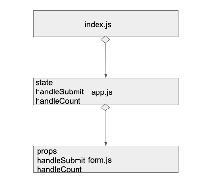

 LAB
=================================================

## External State Practice

### Author: Melissa

### Links and Resources
* [submission PR](https://github.com/401-advancedjs/external-state-practice/pull/2)
* [travis](https://www.travis-ci.com/401-advancedjs/external-state-practice)

#### Running the app
* `npm run start`
  
#### Tests
* How do you run tests?
* What assertions were made?
  * No assertions were made since there are no "components"
* What assertions need to be / should be made?
  * Nothing at the moment

#### UML
